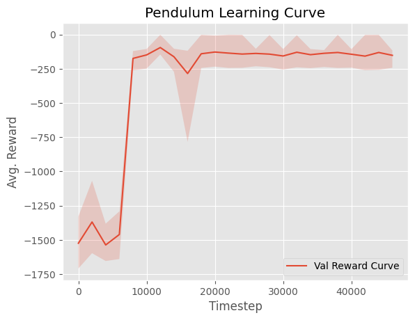
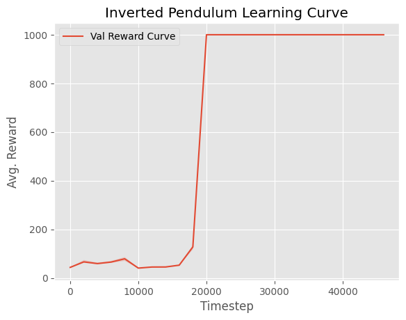
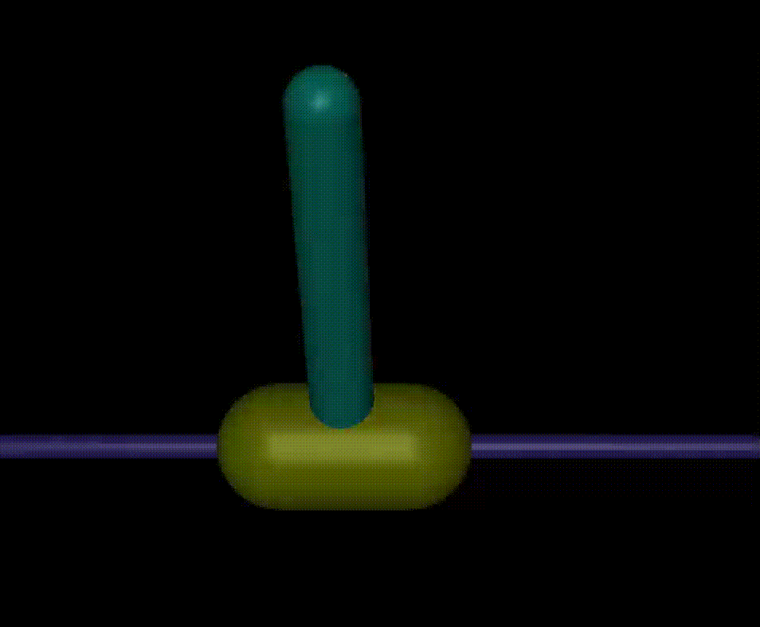

# Implementation of DDPG in Pytorch
------------------------

To run the notebooks/code make sure to install all the necessary packages using 

```bash
uv sync
uv pip sync
```
------------------------
#### Performance on Pendulum 

| Learning Curve             |  Video Example |
:-------------------------:|:-------------------------:
  |  


#### Performance on InvertedPendulum

| Learning Curve             |  Video Example |
:-------------------------:|:-------------------------:
  |  


Reference Paper
[1] Lillicrap, T. P., Hunt, J. J., Pritzel, A., Heess, N., Erez, T., Tassa, Y., Silver, D., & Wierstra, D. (2016). Continuous Control with Deep Reinforcement Learning. International Conference on Learning Representations (ICLR) 2016. 